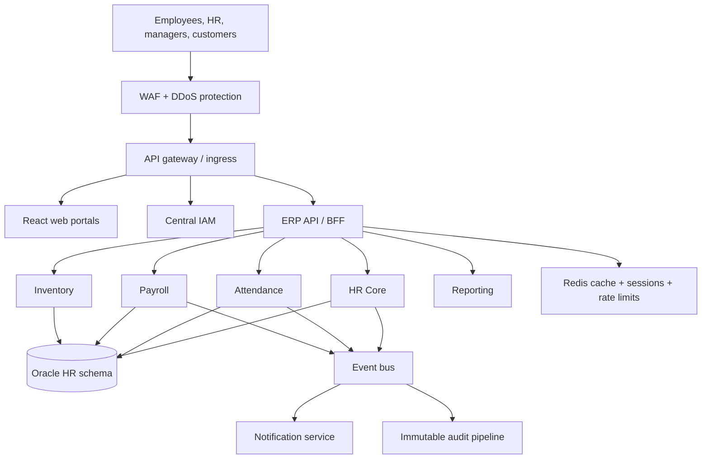

# Commercial Credit — Modern HR ERP Architecture Blueprint

## 1. Executive decision

Build a **domain-driven modular platform** on Laravel and React, deployed on Kubernetes in a **hybrid primary + cloud disaster-recovery topology**. Do not begin with dozens of independently deployed microservices. Start with a well-bounded **HR Core platform** and extract only high-change/high-scale domains (IAM, Attendance, Payroll, Notifications, Reporting) when their operational need is proven.

This preserves the team's Laravel strengths, avoids a big-bang rewrite of the Laravel 5 system, and keeps the ERP continuously upgradeable.

## 2. Target architecture

### Network zones

| Zone | Contents | Rule |
|---|---|---|
| Edge | WAF, load balancer, API gateway | Only public entry point; TLS only |
| Application | React, Laravel APIs, workers | Private; no direct public access |
| Data | Oracle, Redis, event brokers, object storage | Private subnets; least-privilege network policies |
| Operations | CI/CD runners, monitoring, logs, admin bastion | MFA, privileged-access controls, no shared accounts |
| DR cloud | Warm Kubernetes capacity, replicated data/backups | Activated and tested by documented failover runbooks |

## 3. Application boundaries

Use a **modular monolith first** for HR Core, with strict domain boundaries and APIs/events inside the codebase. Each module owns its use cases, rules, database schema/API contract, tests, and migrations.

| Domain | Initial form | Later extraction trigger |
|---|---|---|
| IAM / SSO | Dedicated identity platform | Start separate from day one |
| Employee & organisation | HR Core module | Independent integration or heavy change |
| Leave & workflow | HR Core module | Independent release cadence |
| Attendance | Module / dedicated service | Device integration, high write volume |
| Payroll | Separate bounded service | Sensitive controls and payroll release cycle |
| Inventory | Separate bounded service | Different ownership and integrations |
| Notifications | Dedicated service | Start separate; asynchronous |
| Reporting / analytics | Dedicated read model | Heavy queries must never slow payroll/HR |

Never let services write directly to another service’s tables. One physical Oracle estate may be retained initially, but use separate schemas/users and expose data through APIs, events, or purpose-built read models.

## 4. Identity, SSO, and authorization

Deploy a dedicated IAM platform such as **Keycloak**, in HA, backed by its own supported database. It is the identity provider for ERP, internal systems, and customer-facing applications.

- Use OpenID Connect/OAuth 2.1 for modern applications; use SAML only where a legacy product requires it.
- React applications use Authorization Code + PKCE. APIs validate short-lived JWT access tokens using the issuer’s public keys.
- Centralize MFA, password policy, session timeout, device/session revocation, account lockouts, and risk/audit events.
- Create realms/tenants and clients deliberately: Workforce ERP/internal apps must be isolated from customer identities.
- Replace direct per-user permissions with RBAC plus attributes: role, branch, department, cost centre, employment status, and approval limit. Enforce these on APIs, not only in React.
- Apply separation of duties: a payroll preparer cannot approve/release the same pay run; privileged roles need just-in-time elevation and complete audit trails.

SSO means a user who signs in to IAM can access authorized systems without signing in again; it does **not** mean every application trusts every token. Each client, audience, scope, redirect URI, and access policy remains separate.

## 5. Data, Oracle, and integration strategy

- Keep existing Oracle schemas/stored procedures behind an anti-corruption layer: repositories/adapters translate legacy structures into domain models.
- New capabilities use service-owned Oracle schemas and migration versioning. No cross-schema ad-hoc updates.
- Use short database transactions; ensure payroll calculations and approvals are idempotent and have a clear reconciliation process.
- Publish business events through the **transactional outbox pattern**: write the business update and outbox record in one Oracle transaction, then a worker publishes reliably.
- Use RabbitMQ for commands/work queues, retries, delayed processing, and notifications. Add Kafka only for high-volume event streaming, audit/event retention, or data-platform consumers—do not run both by default merely because they are available.
- Use REST/JSON for external and broad integrations; gRPC for controlled internal, low-latency calls where both teams own the contract. Version every API/event contract.
- Build reporting from replicated/read-model data, not live multi-table operational queries. Use Oracle read replicas/standby or an analytics store as required.

## 6. Security baseline

- Zero-trust segmentation: private services, Kubernetes NetworkPolicies, mTLS/service identity where needed, and no database exposure to user networks.
- TLS 1.2+ externally and internally where supported; secrets in Vault or a cloud/on-prem secrets manager, never `.env` in source control, images, or logs.
- WAF, rate limits, bot/abuse controls, API request-size limits, secure headers, CSRF protection for browser-cookie flows, and strict CORS.
- Encrypt Oracle backups, persistent volumes, and object storage; manage keys in KMS/HSM according to the company security policy.
- SAST, dependency scanning, secret scanning, container scanning, SBOM generation, signed images, DAST before production, and periodic penetration tests.
- Central audit logs for login, role change, employee-data access, export, salary view/change, approval, and configuration change. Audit data must be append-only with restricted read access and retention policy.
- Mask NRIC, bank, salary, and customer data from application logs, analytics, and lower environments. Use synthetic or irreversibly masked test data.

## 7. Reliability, scaling, and operations

Run stateless React/Laravel workloads as containers in Kubernetes. Use at least two replicas for 24/7 critical components, readiness/liveness probes, Pod Disruption Budgets, rolling/canary releases, and Horizontal Pod Autoscaling. Scale API pods by CPU/memory and, for workers, queue depth.

- Redis: cache, rate limiting, distributed locks, and queues only where appropriate; never the system of record.
- Background workers: retry with exponential backoff, dead-letter queues, idempotency keys, and manual replay/reconciliation tools.
- Error tolerance: timeouts, circuit breakers, bounded retries, bulkheads, graceful degradation, and an outbox/inbox approach for duplicate delivery.
- Observability: OpenTelemetry traces, Prometheus metrics, Grafana dashboards, structured JSON logs, error tracking, and alerting linked to a severity/runbook/on-call policy.
- Business monitoring: failed attendance imports, payroll calculation discrepancies, approval backlog, expired certificates, queue age, login anomalies, and DR replication lag.
- Backups: immutable encrypted backups; regularly restore into an isolated environment. Define and agree RPO/RTO per service—not as a single ERP-wide guess.

## 8. Hybrid production and disaster recovery

Primary: company data centre/private cloud Kubernetes cluster across separate failure domains. DR: cloud Kubernetes cluster with encrypted backups and replicated critical data. Keep DR warm for IAM, gateway, payroll, attendance, and core APIs; maintain smaller standby capacity for lower-priority domains.

Use Oracle Data Guard or the organization’s approved Oracle replication/backup architecture for Oracle recovery. Automate infrastructure and application deployment through Infrastructure as Code. Do not rely on manually recreated servers.

Run a failover exercise at least twice a year: fail over selected services, validate SSO, payroll reconciliation, critical integrations, data integrity, failback, and documented recovery time.

## 9. Delivery and upgrade model

| Practice | Required policy |
|---|---|
| Source control | Trunk-based development or short-lived branches; protected main branch |
| CI | lint, unit/integration/contract tests, security scans, build once, signed immutable image |
| CD | Dev → test → UAT → production; automated rollback; progressive rollout for critical APIs |
| Dependencies | Monthly security update window; planned framework/runtime upgrades 2–4 times yearly; emergency CVE path |
| Compatibility | Expand → migrate/backfill → switch → contract; backward-compatible APIs/events during rollout |
| Quality | Architecture decision records, code review, test coverage targets, performance testing and load tests before payroll peaks |
| Governance | Product/domain owners, security review for sensitive changes, documented data ownership |

Maintain a supported-version register for PHP, Laravel, Node.js, React, Oracle drivers, Keycloak, Kubernetes, Linux, and base container images. Treat upgrade work as planned product capacity, not optional maintenance.

## 10. Phased implementation roadmap

### Phase 0 — Foundations (6–10 weeks)
IAM/SSO, React design system, Laravel 12/13 baseline, Oracle connectivity/legacy adapters, Docker local development, CI/CD, secrets, logs/metrics/traces, security baseline, environment separation, and a small Kubernetes production foundation.

### Phase 1 — HR Core (3–6 months)
Employee, organisation hierarchy, roles/attributes, leave/workflow, documents, audit trail, employee self-service, and legacy data migration by bounded module. Run old and new systems in parallel where required; reconcile before cutover.

### Phase 2 — High-risk / high-volume domains (3–6 months)
Attendance integrations, payroll service and approval controls, notifications, integration gateway, reporting read models, and DR failover testing.

### Phase 3 — Selective service extraction (ongoing)
Extract domains only when an independent deployment, scale profile, reliability boundary, ownership boundary, or technology change justifies it. Do not split a service only because it has many database tables.

## 11. Decisions to make before build

1. Confirm primary-site and DR-cloud vendors, required data residency, and branch/network connectivity.
2. Agree RPO/RTO by capability—payroll, attendance, IAM, employee self-service, reporting, and inventory.
3. Inventory every existing Oracle schema, stored procedure, integration, batch job, attendance device, and data owner.
4. Define workforce vs customer identity boundaries, MFA policy, privilege approvals, and audit retention with Information Security.
5. Identify the first 1–3 HR modules for the migration pilot; do not migrate the entire Laravel 5 ERP in one release.

## Benefits

- Modern, supported technology with scheduled upgrades rather than another legacy trap.
- Stronger protection for salary, employee, and customer data through centralized identity, access policies, auditability, and segmentation.
- 24/7 resilience with controlled maintenance, measurable recovery, and tested cloud DR.
- Scale independently for attendance peaks, payroll runs, and customer traffic.
- A migration path that lets the existing Laravel team deliver safely while building microservice capability progressively.

## Primary references

- Kubernetes: Horizontal Pod Autoscaling — https://kubernetes.io/docs/concepts/workloads/autoscaling/horizontal-pod-autoscale/
- Keycloak: Securing Applications and Services — https://www.keycloak.org/docs/latest/securing_apps/
- Oracle: Data Guard overview — https://docs.oracle.com/en/database/oracle/oracle-database/26/haovw/oracle-data-guard.html
